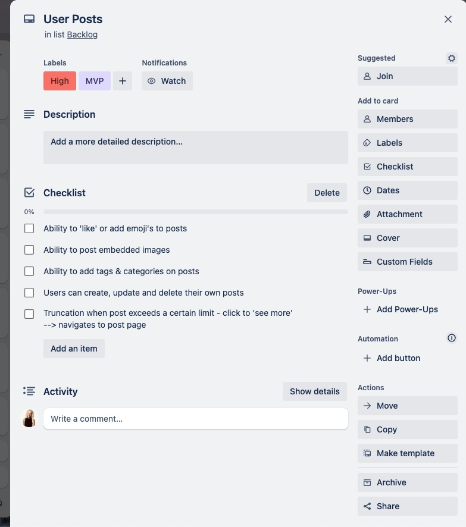

# Sproutly 🌱

A full stack web application by **Alice Tram, Katrice Mountford & Ali Eideh**

## Links
- [Backend Github Repo](https://github.com/alicetra/Plant-Forum-Backend)
- [Frontend Github Repo](https://github.com/kvtrice/sproutly-frontend)

# Table of Contents
- [General](#general)
    - [Purpose](#purpose)
    - [Functionality and Features](#functionality-and-features)
    - [Target Audience](#target-audience)
    - [Tech Stack](#tech-stack)
- [Dataflow Diagrams](#data-flow-diagrams)
- [Application Architecture Diagram](#application-architecture-diagram)
- [User Stories](#user-stories)
- [Wireframes](#wireframes)
- [Development Plan (Trello Board)](#trello-board)
- [References](#references)

# General

## Purpose

Plant enthusiasts currently engage in fragmented online communities focused on various plant-related topics. However, there isn’t a dedicated platform that serves as a comprehensive hub for all things plants, similar to how Goodreads caters to book enthusiasts or IMDB to movie lovers. 

Through research and our own experience, many plant-lovers follow multiple different Facebook groups (such as ‘Plant Identification Australia’ or ‘Plant lovers Melbourne Victoria’) and then they also participate in forums in other places such as reddit (for example: r/houseplants and r/UrbanJungle). Based on this it's clear that people want to be able to talk about their plants and discuss plant-related topics, but they have to go to various other platforms in order to do so (facebook, reddit etc.), wouldn't it be easier if this could be done from a single platform?

Sproutly is a solution to this problem, providing a unified forum platform where people can share their love of plants, ask questions and get plant help when they need it from others in the community.

## Functionality and Features
**Login and Sign up**
- New users are able to create a new account/profile
- Existing users are able to log in to their existing account using their username and password

**User Data**
- Users that are logged in are able to view and update their account details (name, username, password, profile picture).
- Users that are logged in will be able to have a unified view of their previous post and comment history.

**Thread Posts and Comments**
- Users that are logged in are able to start a thread through **creating a new post** with a title, content body and optional image
- Users that are logged in are able to comment on threads (content body). If a user is not logged in they are unable to comment on thread posts.
- All users (logged in or not logged in), will be able to **view** threads and their associated comments and images
- Users that are logged in are able to **edit** and their own comments and thread posts.
- All users are able to view the number of comments currently on a thread post.

**Search and filtering**
- All Users ware able to search threads universally by tags.
- All users are able to filter their homepage by date. This will be a limited choice between either ascending or descending order. This functionality also extends to comments on thread posts.

**Reactions**
- Users that are logged in are able to react (e.g. 'like') to comments and thread posts.
- All users are able to view the number of reactions on a given thread post or comment.

**Infinite scroll**
- To enhance the user experience we will implement an infinite scroll feature on the user home page rather than pagination. This is in line with current industry standards and is a common user flow in similar applications in the market today.

**Dark Mode**
- To enhance user experience and prevent eyestrain we will implement a dark mode option which is a very popular web design feature.

## Target Audience

Given our purpose, our application is targeted towards those in the plant community, but additionally aimed towards Millennial and Gen-Z users.

In the past caring for plants was largely a hobby loved by older generations, and many platforms or forums that exist today are aimed towards that demographic. However since the COVID pandemic a younger audience has started to develop a love for plants, with a study by CivicScience showing that 21% of millenial and gen-z cohorts identify as 'plant parents'. 

For this reason, along with the fact that both groups are highly active and engaged in online communities in general, Sproutly will be aimed towards those aged roughly between 18 - 40. In order to make our application attractive to our target audience we're going to place a high emphasis on bold and bright colours, modern UI components, interactivity and accessibility.

## Tech Stack

We will be using the MERN stack to create our application, which includes:

#### MongoDB
MongoDB serves as the database in the MERN stack, it's non-relational and excels at handling flexible data stored in JSON-like documents. MongoDB facilitates storage, retrieval, and manipulation of data which is crucial for our full stack applciation to work smoothly.

#### Express.js 
Express.js is a lightweight server-side framework. In particular it helps to simplify tasks such as routing, middleware handling, and request/response management. We will be using it to create our backend APIs and handle HTTP requests.

#### React
React is a frontend Javascript library that will enable us to build dynamic user interfaces. It facilitates the creation of reusable components, helps to manage state within the application, and efficiently updates the UI based on data changes. We will be using it to build our front-end web page, which will ultimately be a single-page application (SPA) where components will update without page reloads. 

#### Node.js
Node.js is a server-side JavaScript runtime that enables the running of JavaScript code outside of a web browser. It provides an event-driven, non-blocking model, making it efficient for handling asynchronous requests. Node.js will be used alongside Express.js to help develop our server-side tasks.

# Data Flow Diagrams
We developed a Level 0 Data Flow Diagram (DFD) in the context of our project to provide an overarching view of our data. This highest level DFD represents major processes, data flows, and database within the system without delving into their intricate details.

The need for flexibility drives our choice to utilize a Level 0 DFD: we aim to grasp the data flow model broadly, without fixating on specific details. This strategic approach accommodates potential changes—likely during the upcoming production phase.

**Note that diagrams are SVG so open in live server to view if you are reading this as a MD file. If you are viewing this from the github depo on a laptop the full diagram might not be shown unless you click on the SVG file. Feel free to zoom in of any diagram**

### Individual functions data flow system

### Overarching project dataflow 

Please note that for readability, the ouput back to user wasn't shown in this overarching diagram. Please look at the indivudal functions dataflow (above) to view that flow back to user if needed.

# Application Architecture Diagram

The Application Architecture Diagram (AAD) provides a high-level overview of the system's architecture. *Sproutly* is a MERN, full-stack implementation. On the backend, the application is powered by a Node.js server running Express.js, which interfaces with a NoSQL MongoDB database. The frontend is built using React, rendering various UI components dynamically, including HTML, CSS and embedded JavaScript. React communicates with the backend via HTTP requests which via Express.js will facilitate Restful API calls. The application's frontend and backend are hosted on separate servers, with the frontend hosted on Netlify and the backend to be hosted on Render. With respect to the database, MongoDB Atlas will be the cloud service hosting it. The database itself interfaces with the Node.js backend server via the Object Data Modelling (ODM) library, Mongoose. 

 

# User Stories

## *Initial User Stories*

Described as a means to capture, design and shape the core features of Sproutly from the perspective of the end user, user stories as well as associated forum personas were initially fleshed out in a brainstorming session centred around the user experience and tropes related to gardening and plant keeping. Group members' personal experiences of using forums and discussion boards provided the impetus for the initial set of user stories which as of *February 13* list as follows: 

#### Forum Browser/ 'Lurker':

- As a user, I want to be able to view the forum without having to sign up or log in, so that I don't have to go through a tedious sign-up process.
  
- As a user, I want to be able to make observations about the forum without having to sign up or log in, so that I can decide if I want to join the community as I am still undecided.
  
- As a browser and information seeker who is without a need or desire to make their own contributions, I still would like to have access to the forum's full search functionality (tag seraching), so that I might obtain information I need for my purposes as well as access to user pages of registered community members whose advice and contributions I might like to shadow. 

#### Prolific Poster/ 'Main Contributor':

- As a user who is inclined towards frequently contributing to the community/posting and is a forum mainstay/part of the furniture type user, I would like to have access to a page which displays my post history that for posterity I might need to reference or for the purpose of self-reflection and improvement.

#### Upvote Accumulator/ 'Karma Farmer':

- As a user who is inclined towards garnering upvotes, I want to be able to  post frequently and exploit the tag functionality, so that I might appeal to as many community members as possible and maximise the value of my contributions.

- As a Karma Farmer, I would like to have a user page which displays in a not unconspicuous section of the page my like total, which serves as a badge of honour and a display of my worth to the community. 

<strong> General User Stories</strong>

- As a user, I want to be able to sign up and log in, so that I can access the full functionality of the forum and contribute to the community.

- As a user, I want to be able to edit my posts, so that I can correct any mistakes I may have made, improve the quality of my content and keep my posts up to date. 
  
- As a user, I want to be able to delete my posts, so that I can remove any content I no longer wish to share with the community. This may be due to a change of heart, a change in the relevance of the content or a change in the accuracy of the content.

- As a user, I want to be able to upvote posts, so that I can show my appreciation for content in the community and/or to increase the value of a particular contribution.

- As a user, I want to be able to filter posts by tags so that I can find the information I need quickly and easily and so that I can find the most relevant information to me. 

- As a user, I would like to change the display of the forum to a dark mode, so that I can reduce eye strain and improve my user experience. Vice versa, I would like to change the display of the forum to a light mode, so that I can improve the visibility of the forum according to my own personal preferences.

- As a user, I would like to sort posts by date, so that I might keep up to date with popular and recent posts, be informed about community affairs and be able to find the most relevant information quickly and easily. Conversely, I would like to use this functionality to search through older posts to find material pertaining to a particular time period.

- As a user, I would like to be able to create untagged posts on the fly, without having to navigate to a new page or scroll. This is so that I can create posts that are short and/or are not too complex, quickly and easily.

- As a user who is detail oriented and who prioritises quality over quantity, I would like to carefully curate my posts on a dedicated page with access to more post creation tools such as image embedding and post tagging, to that end.

-   As a detail oriented user, I would like in place a warning mechanism on the ceate post page which would provide me peace of mind in knowing my posts wont accidentally be discarded in the case of a misclick that might otherwise navigate me to a new page or clear the contents of my draft. This is so that I can focus on the quality of my content without fear of losing it. 

- As a registered user, I would like to engage with the community in a way that is familiar and intuitive to me with dynamic page buttons/symbols which either like a post or direct me to comment on the post/thread, a feature common to social media platforms.

- As a registered user, I would like to, where possible (i.e. non-thread starters), delete comments I have made on posts, so that I can remove any content I no longer wish to share with the community or which was posted egregiously/impulsively. Furthermore, I would like to protect my comment contributions from hasty decision making with an "are you sure?" prompt before the comment is deleted.

- As a registered user, I would like to, where possible (i.e. non-thread starters), edit comments I have made on posts, so that I can correct any mistakes I may have made or improve the quality of my content.

- As a prospective user of Sproutly (the name of the forum), I would like a straightforward and intuitive sign-up process, which in addition to necessary credentials asks for most a profile picture and the plants I own. This would encourage me to join the community and not be dissuaded by a lengthy sign-up process.

## *Refined User Stories*

Upon discussion and further development of our ideas, the need to delineate specific terms (such as 'post' and 'comment' and 'thread') and produce concise user stories to reflect these allowed the group to produce a refined set of user stories which associate directly to the wireframed features detailed below and were described as follows on *February 16*:

- As a *logged in user*, I want to able to access the forum's full functionality (react, comment, etc.), so that I can contribute to the Sproutly community directly.
   
- As a *browser*, I want full visibility of the forum's content (posts and threads) so that I can enjoy the full breadth of the community's contributions without having to sign up. 

- As a *user*, I want to be able to filter thread posts by tags, so that I can filter content to my specific plants,interests and/or needs.

- As a *logged in user*, I want to be able to create thread posts, so that I can contribute to the *Sproutly* community.

- As a user with a *preference for content dense thread posting*, I want a 'discard post' alert box feature to mitigate losing my content to a misclick, so that I can focus on the quality of my content without fear of losing it. 

-  As a *browser*, I want to be able to sort thread posts and comments by date, to scope out the most recent and/or most relevant content.

- As a *logged in Sproutly user* who is familiar with social media functionality, I want to be able to comment on threads no matter how far I have scrolled, so that I can conveniently engage with thread posts in a manner intuitive to me.

- As a *registered user of Sproutly*, I would like to be welcomed by a simple login page, so that I can jump straight into the forum with ease. 

- As a *seasoned plant enthusiast* or *millenial plant newbie*, I would like to join the *Sproutly* community so that I can showcase my lineup of plants and/or demonstrate and share my plant caring expertise.

- As a *registered Sproutly user*, I would like to be able to edit my profile on a dedicated page, in a manner familiar to me (i.e. exact fields and presentation of the sign-up page), so that I can keep my profile relevant and my plant keeping record up to date.

- As a *registered Sproutly user* with a desire to delete my profile, I would like an option on the edit profile page to facilitate this, so that I can erase my data from the forum and leave the community if I so choose.

- As a *browser* or *registered user* who is interested in a particular user's contributions, I would like to be able to view a page dedicated to their post history and total like count, so that I can view their contributions and engage more deeply with the community.

# Wireframes

All un-annotated wireframes can be found under `Wireframes/Original`

### Home Page for logged in users

The home page serves as the entry point to our website. All users will be able to view this page, however some menu items and functionality will be limited to only those that are logged in (such as reacting, commenting, edit / view profile)

### Home page for users that aren't logged in

For users that have not signed up or are not logged in, they will still have full visibility of the forum posts and threads (so they can remain a 'browser'), but they will not be able to react to thread posts or add comments to thread posts. As such, some components and action items will be hidden from view.

### Searching based on Tags

All users are able to search the forum based on searching for existing tags and adding the tags as search parameters. This filters the thread posts based on the selected tags for the user. One or more tags can be added to the search and the search will match to any matching tag (not *all* matching tags - it doesn't increase specificity).

### Creating a Post

Users that are logged in will be able to create a thread post, either from the 'post something' homepage component or via the 'create post' button in the nav bar; both of which navigate to this create post component.

### Discarding a post

Users can discard a thread post if they no longer wish to continue; this will prompt for confirmation from the user before it is actioned.

### Viewing threads

All users are able to view threads, however 'browsers' have limited actions outside of 'viewing'.

### Commenting on threads

If the user is logged in, they are able to add new comments, edit comments and delete comments on thread posts.

### User login

The login page is where an existing user can enter their credentials to log back into their user account. This page can be accessed from the 'login' button in the navbar.

### User sign up

The signup page is where a new user can create a new account for Sproutly. This page can be accessed from the 'Join' button in the navbar.

### User edit profile

Logged in users are able to edit their user details through clicking either the profile picture icon (desktop) or the 'edit profile' button in the nav bar.

### User view profile

All users are able to view another users public profile through clicking on their username (via a thread post or comment). If a user is logged in, they are also able to navigate to view their own public profile through clicking on the profile picture icon (desktop) or the 'view profile' button in the nav bar. 

# Trello Board

Link to live board

### Friday 9 Feb

### Monday 12 Feb

### Tuesday 13 Feb

### Wednesday 14 Feb

### Thursday 15 Feb

### Friday 16 Feb

# References 
GeeksforGeeks. (n.d.). Levels in Data Flow Diagrams (DFD). Available at: https://www.geeksforgeeks.org/levels-in-data-flow-diagrams-dfd/

Revitsky, L. (2020). Gen Z Houseplant Ownership Stems from the Desire to Care for Something Alive. [online] CivicScience. Available at: https://civicscience.com/gen-z-houseplant-ownership-stems-from-the-desire-to-care-for-something-alive/.

Starbuck, L. (2022). Houseplants boomed during the pandemic. Gen Z and Millennials say the popularity is here to stay. [online] KUNR Public Radio. Available at: https://www.kunr.org/business-and-economy/2022-12-28/houseplants-boomed-during-pandemic-gen-z-millennials-say-popularity-stays-tiktok.
